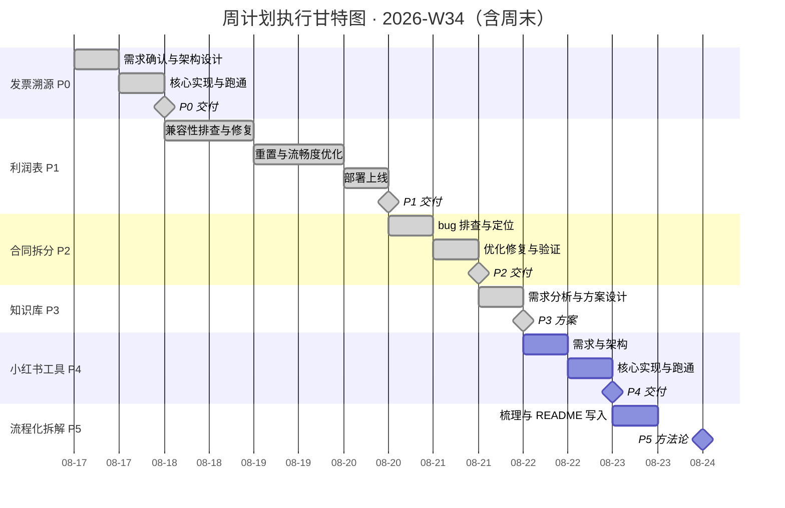

# 周计划执行表 · 2026-W34（AGENT.md 格式）

> 本文件按 AGENT.md 约定编写：任务有全局唯一 ID、状态使用固定枚举、关键数据在 frontmatter 与 JSON 摘要中可程序化解析。AI 代理或人类执行者遵循同一套约定更新本文件。

---

## 0. 读取约定（Conventions）

| 元素 | 约定 |
| :--- | :--- |
| 任务 ID | `T01`–`T06`，全局唯一；依赖、里程碑、风险均通过 ID 引用 |
| 状态枚举 | `todo` 待开始 / `in_progress` 进行中 / `done` 已完成 / `blocked` 阻塞 |
| 日期格式 | 机器可读字段一律 ISO `YYYY-MM-DD`（frontmatter、JSON）；表格保留「周一 08-17」便于人读 |
| 优先级 | P0（最高）→ P5，P 值越小越优先 |
| 数据权威性 | §2 任务登记表为唯一事实来源；§6 甘特图仅为可视化，改任务以登记表为准 |
| 更新规则 | 每完成一个交付节点：更新任务状态、§5 里程碑状态、frontmatter `status` 与 `priority_p0_complete`；风险只追加不删除；决策写入 §8 决策日志 |
| 未完成任务 | 若计划过期（today > period_end）且任务仍为 `todo`，先询问是否顺延/重排，不要静默修改日期 |

---

## 1. 周目标（Mission）

本周聚焦六项核心任务：周一首日攻坚发票溯源 MVP，利润表居中推进，合同拆分 debug 收尾，知识库权重殿后，周六开发小红书文案图文工具 MVP，周日完成流程化拆解方法论写入 README。

**可衡量结果（Objective & Key Results）：**
- [x] **KR1**：T01 发票溯源 MVP 周一（08-17）端到端跑通并完成可演示交付
- [x] **KR2**：T02 利润表周四（08-20）部署上线，兼容性 + 流畅度达标
- [ ] **KR3**：5 项交付物 + 1 篇方法论 README，周日（08-23）全部完成

---

## 2. 任务登记表（Task Registry）

| ID | 任务 | 优先级 | 状态 | 计划开始 | 计划结束 | 工时 | 交付物 | 依赖 |
| :-: | :--- | :----: | :---: | :---: | :---: | :--: | :--- | :--- |
| T01 | 发票溯源系统 MVP | P0 | `done` | 周一 08-17 | 周一 08-17 | 1.0 天 | 可跑通 MVP + 演示验证 + 接口与数据模型文档 | – |
| T02 | 利润表前端重置与部署 | P1 | `done` | 周二 08-18 | 周四 08-20 | 2.5 天 | 已上线前端 + 优化报告 + 性能基准对比 | T01 |
| T03 | 合同拆分系统 debug | P2 | `done` | 周四下午 08-20 | 周五上午 08-21 | 1.0 天 | 优化后系统 + bug 修复清单 + 回归测试报告 | T02 |
| T04 | 知识库用户权重研发 | P3 | `done` | 周五下午 08-21 | 周五 08-21 | 0.5 天 | 技术方案文档 + 下周研发计划 | T03 |
| T05 | 小红书文案图文工具 MVP | P4 | `todo` | 周六 08-22 | 周六 08-22 | 1.0 天 | 可跑通 MVP + 演示验证 | T04 |
| T06 | 流程化拆解方法论 | P5 | `todo` | 周日 08-23 | 周日 08-23 | 0.5 天 | README 方法论（流程图 + 检查清单 + 关键决策点） | T05 |

---

## 3. 任务详情与验收标准（含 DoD）

> 每个任务块使用固定子标题：`目标` / `关键动作` / `验收标准(DoD)` / `交付物`。验收标准即完成定义——全部满足才可将状态置为 `done`。

### T01 · 发票溯源系统 MVP `P0 · done`

**目标**：周一首日攻坚，实现 MVP 可执行效果，端到端正常跑通。

**关键动作**
- [x] MVP 边界确认：明确核心溯源链路与最小可用范围
- [x] 数据模型设计：发票实体、关联关系、溯源路径
- [x] 接口契约定义与项目骨架搭建
- [x] 核心链路实现：发票录入 → 关联校验 → 溯源输出
- [x] 端到端跑通验证，修复阻断性问题
- [x] 可演示交付准备

**验收标准(DoD)**
- [x] 核心溯源链路端到端正常跑通
- [x] 发票录入与关联校验功能可用
- [x] 溯源结果正确输出，可验证
- [x] 无阻断性 bug，可正常演示
- [x] 代码结构清晰，便于后续迭代

**交付物**：可跑通的发票溯源 MVP + 演示验证 + 接口与数据模型文档

### T02 · 利润表前端重置与部署 `P1 · done`

**目标**：居中推进，完成流畅度优化、兼容性修复并部署上线。

**关键动作**
- [x] 兼容性问题全面排查：浏览器差异、分辨率适配、响应式断点
- [x] 前端重置逻辑梳理，组件渲染链路优化
- [x] 流畅度提升：渲染性能、动画优化、交互响应
- [x] 性能基准测试，对比 FCP / LCP / TBT 指标
- [x] 测试环境冒烟测试 → 生产环境部署（8/20）
- [x] 上线后稳定性监控与兼容性确认（8/20）

**验收标准(DoD)**
- [x] 主流浏览器（Chrome / Edge / Safari）渲染一致
- [x] 移动端与桌面端响应式适配正常
- [x] 核心交互流畅，无明显卡顿与掉帧
- [x] 性能指标达到基线要求
- [x] 生产环境部署完成且运行稳定（8/20）

**交付物**：已部署上线的利润表前端 + 兼容性流畅度优化报告 + 性能基准对比数据

### T03 · 合同拆分系统优化 debug `P2 · done`

**目标**：完成现存 bug 排查与修复，优化拆分逻辑，通过测试验证。

**关键动作**
- [x] 现存 bug 复现与错误日志收集（8/20）
- [x] 拆分逻辑缺陷定位：边界条件、异常输入、数据一致性（8/20）
- [x] 输出 bug 清单与修复优先级排序（8/20）
- [x] 实施 bug 修复与拆分逻辑优化（8/19 前端 UI 重构 + bug 修订）
- [x] 回归测试，验证修复效果（8/21）
- [x] 边界场景覆盖测试（8/21）

**验收标准(DoD)**
- [x] 已知 bug 全部修复并验证
- [x] 拆分逻辑在边界场景下表现正确
- [x] 回归测试通过，无新增问题
- [x] 异常输入处理健壮，无崩溃

**交付物**：优化后的合同拆分系统 + bug 修复清单 + 回归测试报告

### T04 · 知识库用户权重研发 `P3 · done`

**目标**：工作日最后启动，完成需求分析与权重模型设计，输出技术方案。

**关键动作**
- [x] 用户权重业务需求分析：权重应用场景与目标
- [x] 数据来源梳理：用户行为、内容互动、权限层级
- [x] 权重维度设计：活跃度、贡献度、专业度等
- [x] 权重计算模型设计：公式、阈值、衰减策略
- [x] 技术方案输出与下周研发路径规划

**验收标准(DoD)**
- [x] 需求分析清晰，场景与目标明确
- [x] 权重维度覆盖核心业务诉求
- [x] 计算模型可解释、可调参
- [x] 技术方案具备可行性，可指导下周研发

**交付物**：知识库用户权重技术方案文档 + 下周研发计划

### T05 · 小红书文案图文工具 MVP `P4 · todo`

**目标**：周六全天开发 MVP，实现文案生成与图文排版核心功能可跑通。

**关键动作**
- [ ] 需求确认：文案生成 + 图文排版核心功能边界
- [ ] 技术选型与架构设计，搭建项目骨架
- [ ] 设计文案模板与图文排版数据结构
- [ ] 实现文案生成逻辑与图文排版引擎
- [ ] MVP 端到端跑通验证，修复阻断性问题
- [ ] 可演示交付准备

**验收标准(DoD)**
- [ ] 文案生成功能可用，输出可读
- [ ] 图文排版引擎正常工作，输出可预览
- [ ] MVP 端到端跑通，无阻断性 bug
- [ ] 可正常演示核心流程
- [ ] 代码结构清晰，便于后续迭代

**交付物**：可跑通的小红书文案图文工具 MVP + 演示验证

### T06 · 流程化拆解方法论 `P5 · todo`

**目标**：周日梳理本周工作流程化拆解方法论，写入 README 文档。

**关键动作**
- [ ] 梳理本周六项任务执行流程，提炼共性方法论
- [ ] 总结发票溯源、利润表重置的标准化步骤
- [ ] 总结合同拆分 debug、小红书工具 MVP 的问题定位方法
- [ ] 将方法论写入 README，包含流程图与关键决策点

**验收标准(DoD)**
- [ ] 方法论覆盖本周全部任务类型
- [ ] 流程步骤可复用，非个案描述
- [ ] README 结构清晰，含检查清单
- [ ] 关键决策点与风险点有明确标注

**交付物**：README 流程化拆解方法论文档（含流程图、检查清单、关键决策点）

---

## 4. 每日执行时间线（Schedule）

### 周一 08-17 · 发票溯源攻坚

| 时段 | 任务 ID | 任务 | 要点 |
| :--- | :-----: | :--- | :--- |
| 09:00–12:00 | T01 | 发票溯源 MVP · 需求确认与架构设计 | 确认 MVP 边界与核心溯源链路；设计数据模型；定义接口契约，搭建项目骨架 |
| 14:00–18:00 | T01 | 发票溯源 MVP · 核心实现与跑通 | 实现核心链路：录入 → 关联校验 → 溯源输出；端到端跑通验证；完成可演示交付 |

### 周二 08-18 · 利润表启动

| 时段 | 任务 ID | 任务 | 要点 |
| :--- | :-----: | :--- | :--- |
| 09:00–12:00 | T02 | 利润表 · 兼容性问题排查与梳理 | 列出现存兼容性问题清单；定位流畅度瓶颈点；输出优先级排序与修复方案 |
| 14:00–18:00 | T02 | 利润表 · 兼容性修复实施 | 修复 Chrome / Edge / Safari 渲染差异；响应式断点与移动端适配；回归测试 |

### 周三 08-19 · 利润表攻坚

| 时段 | 任务 ID | 任务 | 要点 |
| :--- | :-----: | :--- | :--- |
| 09:00–12:00 | T02 | 利润表 · 前端重置与流畅度优化 | 重构重置逻辑与渲染链路；虚拟列表、防抖节流、懒加载；消除掉帧 |
| 14:00–18:00 | T02 | 利润表 · 流畅度调优与部署准备 | 对比 FCP / LCP / TBT；全链路回归测试；部署包与部署前检查清单 |

> 实际（8/19）：T02 流畅度 + UI 重构 ✅；T03 合同拆分前端重构 + bug 修订提前介入 ✅；另学习 Obsidian 插件生态、整理项目全貌。

### 周四 08-20 · 部署 + 转场 ✅ 已完成

| 时段 | 任务 ID | 任务 | 要点 |
| :--- | :-----: | :--- | :--- |
| 09:00–12:00 | T02 | 利润表 · 部署上线与验证 | 测试环境冒烟 → 生产部署；稳定性监控；标记 P1 完成 |
| 14:00–18:00 | T03 | 合同拆分系统 · bug 排查与定位 | 复现 bug 收集日志；定位拆分逻辑缺陷；输出 bug 清单与修复优先级 |

> 实际（8/20）：T02 利润表部署上线 + 稳定性验证 ✅；T03 合同拆分 bug 定位 ✅；另完成利润宝进度监督工程优化（日志确认）。

### 周五 08-21 · 收尾 + 殿后 ✅ 已完成

| 时段 | 任务 ID | 任务 | 要点 |
| :--- | :-----: | :--- | :--- |
| 09:00–12:00 | T03 | 合同拆分系统 · 优化修复与验证 | 实施修复与逻辑优化；回归测试与边界覆盖；标记 P2 完成 |
| 14:00–18:00 | T04 | 知识库用户权重 · 需求分析与方案设计 | 需求与数据来源分析；权重模型与维度设计；输出技术方案 |

### 周六 08-22 · 小红书工具

| 时段 | 任务 ID | 任务 | 要点 |
| :--- | :-----: | :--- | :--- |
| 09:00–12:00 | T05 | 小红书文案图文工具 · 需求与架构 | 确认 MVP 边界；技术选型与骨架搭建；设计文案模板与排版数据结构 |
| 14:00–18:00 | T05 | 小红书文案图文工具 · 核心实现与跑通 | 实现文案生成与排版引擎；端到端跑通；可演示交付 |

### 周日 08-23 · 方法论沉淀

| 时段 | 任务 ID | 任务 | 要点 |
| :--- | :-----: | :--- | :--- |
| 灵活时段 | T06 | 流程化拆解方法论 · 梳理与 README 写入 | 提炼可复用拆解方法；总结四项任务标准化步骤；写入 README（流程图 + 检查清单 + 决策点） |

---

## 5. 工时分配（Workload，单位：小时）

| 任务 | 周一 | 周二 | 周三 | 周四 | 周五 | 周六 | 周日 | 合计 |
| :--- | :--: | :--: | :--: | :--: | :--: | :--: | :--: | :--: |
| T01 发票溯源 P0 | 7 | – | – | – | – | – | – | 7 |
| T02 利润表 P1 | – | 7 | 7 | 3.5 | – | – | – | 17.5 |
| T03 合同拆分 P2 | – | – | – | 3.5 | 3.5 | – | – | 7 |
| T04 知识库 P3 | – | – | – | – | 3.5 | – | – | 3.5 |
| T05 小红书工具 P4 | – | – | – | – | – | 7 | – | 7 |
| T06 流程化拆解 P5 | – | – | – | – | – | – | 4 | 4 |
| **当日合计** | **7** | **7** | **7** | **7** | **7** | **7** | **4** | **46** |

---

## 6. 里程碑与交付清单（Milestones）

| 里程碑 ID | 日期 | 里程碑 | 关联任务 | 交付物 | 状态 |
| :---: | :--- | :--- | :--- | :--- | :---: |
| M1 | 周一 08-17 | 发票溯源 MVP 跑通交付 | T01 | 可演示 MVP + 接口文档 | `done` |
| M2 | 周二 08-18 | 利润表兼容性修复完成 | T02 | 问题清单 + 修复提交 | `done` |
| M3 | 周三 08-19 | 利润表流畅度优化完成 | T02 | 性能基准对比 + 部署包 | `done` |
| M4 | 周四 08-20 | 利润表部署上线 + 合同 bug 定位 | T02 / T03 | 生产部署 + bug 清单 | `done` |
| M5 | 周五 08-21 | 合同拆分优化完成 + 权重方案输出 | T03 / T04 | 优化系统 + 技术方案文档 | `done` |
| M6 | 周六 08-22 | 小红书文案图文工具 MVP 跑通 | T05 | 可演示 MVP | `todo` |
| M7 | 周日 08-23 | 流程化拆解方法论写入 README | T06 | README 方法论文档 | `todo` |

---

## 7. 任务进度甘特图（可视化）



---

## 8. 风险登记册（Risk Register）

| 风险 ID |  级别  | 风险                                | 影响任务 | 应对预案                                        |   状态   |     |
| :---: | :--: | :-------------------------------- | :--- | :------------------------------------------ | :----: | --- |
|  R1   | 🔴 高 | 发票溯源 MVP 当日跑通受阻（关联校验/数据一致性阻断 bug） | T01  | 上午严格限定 MVP 最小边界；下午集中攻坚；必要时降级演示范围保跑通，阻断项记录延后 | `closed` |     |
|  R2   | 🔴 高 | 利润表兼容性问题超预期，影响周四部署节点              | T02  | 周二即建问题清单按影响排序；优先修阻断项；确保周四上午部署不延期            | `closed` |     |
|  R3   | 🟡 中 | 小红书工具 MVP 一日内难以跑通（引擎复杂度高）         | T05  | 上午限定最小功能集；先保文案生成，排版降级为简单模板渲染                | `open` |     |
|  R4   | 🟢 低 | 流程化拆解方法论范围蔓延，README 冗长            | T06  | 聚焦可复用流程；以检查清单 + 流程图为主；控制在单文件可读范围            | `open` |     |

---

## 9. 决策日志（Decision Log）

> 记录执行中做出的关键决策。格式：日期 · 决策 · 理由 · 影响任务。只追加，不删除。

| 日期 | 决策 | 理由 | 影响任务 |
| :--- | :--- | :--- | :--- |
| _（示例）2026-08-18_ | _若 T01 受阻：砍掉非核心分支，降级演示范围_ | _保 MVP 当日跑通（R1 预案）_ | _T01_ |
| 2026-08-17 | 发票溯源 MVP 当日端到端跑通并交付 | 严格限定最小边界，P0 达标（R1 关闭） | T01 |
| 2026-08-19 | 合同拆分 bug 修订提前到周三，与利润表攻坚并行 | 重构前端时顺手修复已复现 bug，不阻塞 8/20-21 收尾 | T03 |
| 2026-08-19 | 利润表 UI 重构与流畅度优化同日完成 | 冲刺 8/20 部署节点不受影响 | T02 |
| 2026-08-20 | 利润表部署上线完成，兼容性 + 流畅度达标（R2 关闭） | 部署节点如期达成，生产运行稳定 | T02 |
| 2026-08-21 | 合同拆分 debug 收尾完成（回归 + 边界覆盖通过） | 已知 bug 全部修复，无新增问题 | T03 |
| 2026-08-21 | 知识库用户权重方案输出完成（需求分析 + 权重模型） | 权重隔离需求落地，可指导下周研发 | T04 |

---

## 10. 机器可读摘要（Machine-readable JSON）

> 程序化解析用；与 §2 任务登记表保持一致。

```json
{
  "plan_id": "W34-2026",
  "type": "weekly-plan",
  "period": { "start": "2026-08-17", "end": "2026-08-23" },
  "status": "in_progress",
  "owner": "Bruce",
  "tasks": [
    { "id": "T01", "name": "发票溯源系统 MVP", "priority": "P0", "status": "done", "start": "2026-08-17", "end": "2026-08-17", "hours": 7, "depends_on": [] },
    { "id": "T02", "name": "利润表前端重置与部署", "priority": "P1", "status": "done", "start": "2026-08-18", "end": "2026-08-20", "hours": 17.5, "depends_on": ["T01"] },
    { "id": "T03", "name": "合同拆分系统 debug", "priority": "P2", "status": "done", "start": "2026-08-20", "end": "2026-08-21", "hours": 7, "depends_on": ["T02"] },
    { "id": "T04", "name": "知识库用户权重研发", "priority": "P3", "status": "done", "start": "2026-08-21", "end": "2026-08-21", "hours": 3.5, "depends_on": ["T03"] },
    { "id": "T05", "name": "小红书文案图文工具 MVP", "priority": "P4", "status": "todo", "start": "2026-08-22", "end": "2026-08-22", "hours": 7, "depends_on": ["T04"] },
    { "id": "T06", "name": "流程化拆解方法论", "priority": "P5", "status": "todo", "start": "2026-08-23", "end": "2026-08-23", "hours": 4, "depends_on": ["T05"] }
  ],
  "milestones": [
    { "id": "M1", "date": "2026-08-17", "name": "发票溯源 MVP 跑通交付", "task_ids": ["T01"], "status": "done" },
    { "id": "M2", "date": "2026-08-18", "name": "利润表兼容性修复完成", "task_ids": ["T02"], "status": "done" },
    { "id": "M3", "date": "2026-08-19", "name": "利润表流畅度优化完成", "task_ids": ["T02"], "status": "done" },
    { "id": "M4", "date": "2026-08-20", "name": "利润表部署上线 + 合同 bug 定位", "task_ids": ["T02", "T03"], "status": "done" },
    { "id": "M5", "date": "2026-08-21", "name": "合同拆分优化完成 + 权重方案输出", "task_ids": ["T03", "T04"], "status": "done" },
    { "id": "M6", "date": "2026-08-22", "name": "小红书文案图文工具 MVP 跑通", "task_ids": ["T05"], "status": "todo" },
    { "id": "M7", "date": "2026-08-23", "name": "流程化拆解方法论写入 README", "task_ids": ["T06"], "status": "todo" }
  ],
  "risks": [
    { "id": "R1", "level": "high", "task_ids": ["T01"], "status": "closed" },
    { "id": "R2", "level": "high", "task_ids": ["T02"], "status": "closed" },
    { "id": "R3", "level": "medium", "task_ids": ["T05"], "status": "open" },
    { "id": "R4", "level": "low", "task_ids": ["T06"], "status": "open" }
  ]
}
```

---

*2026-W34 · 2026-08-17 至 2026-08-23（含周末）· 6 tasks · 7 days · 5 deliverables + 1 methodology · v4 AGENT.md 格式 · 最近更新 2026-08-22（T01·T02·T03·T04 done / T05 今日 / T06 明日）*