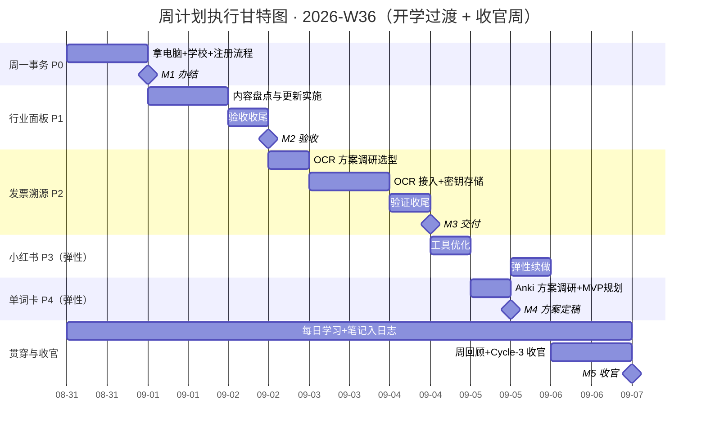

# 周计划执行表 · 2026-W36（AGENT.md 格式）

> 本文件按 AGENT.md 约定编写：任务有全局唯一 ID、状态使用固定枚举、关键数据在 frontmatter 与 JSON 摘要中可程序化解析。AI 代理或人类执行者遵循同一套约定更新本文件。

---

## 0. 读取约定（Conventions）

| 元素 | 约定 |
| :--- | :--- |
| 任务 ID | `T01`–`T07`，全局唯一；依赖、里程碑、风险均通过 ID 引用 |
| 状态枚举 | `todo` 待开始 / `in_progress` 进行中 / `done` 已完成 / `blocked` 阻塞 |
| 日期格式 | 机器可读字段一律 ISO `YYYY-MM-DD`（frontmatter、JSON）；表格保留「周一 08-31」便于人读 |
| 优先级 | P0（最高）→ P6，P 值越小越优先 |
| 弹性任务 | T04 / T05 为弹性任务（「有空就干，没空顺延」）：顺延不视为失败，改状态为 `todo` 并移入下周，不标 `blocked` |
| 数据权威性 | §2 任务登记表为唯一事实来源；§7 甘特图仅为可视化，改任务以登记表为准 |
| 更新规则 | 每完成一个交付节点：更新任务状态、§6 里程碑状态、frontmatter `status` 与 `priority_p0_complete`；风险只追加不删除；决策写入 §9 决策日志 |
| 未完成任务 | 若计划过期（today > period_end）且任务仍为 `todo`，先询问是否顺延/重排，不要静默修改日期 |

---

## 1. 周目标（Mission）

开学过渡周 + Cycle-3 收官周。周一日务优先（公司拿电脑 → 学校布置 → 注册流程走完）；周二~周三完成工作任务「行业面板内容更新」；开发任务（发票溯源 OCR + 密钥存储、小红书工具优化、单词卡立项）全部弹性推进，有空就干、没空顺延。个人主线贯穿全周：每天正常学习、记笔记、进日志。

**可衡量结果（Objective & Key Results）：**
- [ ] **KR1**：T01 周一（08-31）事务全部办结——电脑取回、学校布置完成、注册流程走完
- [ ] **KR2**：T02 行业面板内容更新完成并通过验收（09-02）
- [ ] **KR3**：T03 发票溯源服务器 OCR + 密钥存储落地（弹性，顺延不判失败）
- [ ] **KR4**：T06 开学每日学习笔记进日志，全周不断档

---

## 2. 任务登记表（Task Registry）

| ID | 任务 | 优先级 | 状态 | 计划开始 | 计划结束 | 工时 | 交付物 | 依赖 |
| :-: | :--- | :----: | :---: | :---: | :---: | :--: | :--- | :--- |
| T01 | 周一事务：拿电脑 + 学校布置 + 注册流程 | P0 | `todo` | 周一 08-31 | 周一 08-31 | 1.0 天 | 电脑取回 + 学校布置完成 + 注册流程办结凭证 | – |
| T02 | 行业面板内容更新（新任务） | P1 | `todo` | 周二 09-01 | 周三 09-02 | 1.5 天 | 更新后的行业面板 + 验收记录 | T01 |
| T03 | 发票溯源续更：服务器 OCR + 密钥存储（弹性） | P2 | `todo` | 周三 09-02 | 周五 09-04 | 1.5 天 | 可用 OCR 链路 + 密钥安全存储落地 | T02 |
| T04 | 小红书开发工具继续优化（弹性） | P3 | `todo` | 周五 09-04 | 周六 09-05 | 1.0 天 | 优化记录 + 可验证的改进项 | – |
| T05 | 单词卡立项：Anki 方案调研 + MVP 规划（弹性） | P4 | `todo` | 周六 09-05 | 周六 09-05 | 0.5 天 | 方案调研结论 + MVP 开发排期建议 | – |
| T06 | 开学每日学习 + 笔记入日志（贯穿） | P5 | `todo` | 周一 08-31 | 周日 09-06 | 7.0 小时 | 每日日志（学习内容 + 笔记沉淀） | – |
| T07 | 周回顾 + Cycle-3 收官复盘 | P6 | `todo` | 周日 09-06 | 周日 09-06 | 2.0 小时 | W36 回顾 + 周期评分 + Cycle-4 规划输入 | T01–T06 |
| 加塞 | 影子微信机器人换模型 GLM-5.3-Flash | 加塞 | `todo` | 随时穿插 | 随时穿插 | 不计 | 替换完成验证记录 | – |

> 加塞任务不占工时预算、不挤占原计划（承接 W35 顺延项）；🔒 安全整改（Obsidian 密钥清理 + GitHub 整改，7 项目）按约定**暂不执行**，等 Bruce 确认时机；🚫 硅行业系统继续暂缓待老板过稿。

---

## 3. 任务详情与验收标准（含 DoD）

> 每个任务块使用固定子标题：`目标` / `关键动作` / `验收标准(DoD)` / `交付物`。验收标准即完成定义——全部满足才可将状态置为 `done`。

### T01 · 周一事务：拿电脑 + 学校布置 + 注册流程 `P0 · todo`

**目标**：开学过渡日集中办结三件事，不带尾巴进入教学周。

**关键动作**
- [ ] 上午去公司取回电脑
- [ ] 去学校布置相关事宜
- [ ] 注册流程全部走完，留存办理凭证/截图

**验收标准(DoD)**
- [ ] 电脑已取回并可用
- [ ] 学校布置事项完成
- [ ] 注册流程全部办结，无遗留步骤

**交付物**：事务办结记录（日志）

### T02 · 行业面板内容更新 `P1 · todo`

**目标**：完成行业面板的内容更新（本周新增工作任务），更新准确、可验收。

**关键动作**
- [ ] 盘点待更新内容，输出更新清单（周二上午）
- [ ] 实施内容更新（周二下午~周三上午）
- [ ] 自查 + 验收（周三上午）

**验收标准(DoD)**
- [ ] 更新清单经确认，无遗漏项
- [ ] 面板内容更新完成，数据/文案准确
- [ ] 自查通过，可交付验收

**交付物**：更新后的行业面板 + 更新清单与验收记录

### T03 · 发票溯源续更：服务器 OCR + 密钥存储（弹性） `P2 · todo`

**目标**：解决发票溯源在服务器端的 OCR 识别与密钥存储问题，密钥按安全规范落地。

**关键动作**
- [ ] OCR 方案调研与选型（周三下午）：服务对比、成本、精度
- [ ] 服务器端 OCR 接入与联调（周四）
- [ ] 密钥存储改造：OCR 及相关密钥统一走安全存储（环境变量 / 密钥服务），源码与配置不留明文（周四）
- [ ] 端到端验证 + 收尾（周五上午）

**验收标准(DoD)**
- [ ] 服务器端 OCR 链路可用，识别结果可验证
- [ ] 所有新增密钥走安全存储，仓库与配置中无明文密钥
- [ ] 端到端验证通过，无阻断性问题

**交付物**：可用 OCR 链路 + 密钥存储改造记录

> 弹性任务：顺延不视为失败，移入下周继续（参照 §0 弹性任务约定）。

### T04 · 小红书开发工具继续优化（弹性） `P3 · todo`

**目标**：在 MVP 基础上继续优化小红书开发工具，推进可验证的改进项。

**关键动作**
- [ ] 列出当前待优化项，选 1-2 项实施
- [ ] 改进验证并记录

**验收标准(DoD)**
- [ ] 至少 1 项优化落地并验证可用
- [ ] 优化内容有记录，便于后续迭代

**交付物**：优化记录 + 可验证的改进项

### T05 · 单词卡立项：Anki 方案调研 + MVP 规划（弹性） `P4 · todo`

**目标**：把单词卡投入新一轮计划开发，先出方案结论再动手。

**关键动作**
- [ ] 调研 Anki 开源生态（间隔重复 / 牌组 / 同步）的接入方式
- [ ] 明确词库来源与「每日学习 + 记笔记」节奏的绑定方式
- [ ] 输出方案结论 + MVP 排期建议，灵感沉淀见 [[创作区/开发灵感/单词卡开发灵感]]

**验收标准(DoD)**
- [ ] 方案结论明确（自建 or 复用 Anki、词库来源、与日志的衔接）
- [ ] MVP 范围与排期建议可指导后续开发

**交付物**：单词卡方案调研结论 + MVP 排期建议

### T06 · 开学每日学习 + 笔记入日志（贯穿） `P5 · todo`

**目标**：开学第一周建立稳定节奏——每天正常学习、记笔记，并沉淀进当天日志。

**关键动作**
- [ ] 每天学习 + 记笔记
- [ ] 当天写入日志（干了什么 / 感受 / 卡点）
- [ ] 值得沉淀的知识丢 [[知识卡片/raw/README|raw 素材箱]]

**验收标准(DoD)**
- [ ] 全周日志无缺勤（有事休息的日子也补一行）
- [ ] 学习内容有笔记、有沉淀去向

**交付物**：8/31-9/6 每日日志

### T07 · 周回顾 + Cycle-3 收官复盘 `P6 · todo`

**目标**：W36 是 Cycle-3 最后一周（第 12 周），完成周回顾的同时做周期收官复盘。

**关键动作**
- [ ] 填写 W36 周回顾与周期目标评分
- [ ] Cycle-3 十二周整体复盘：达成情况、遗留项、经验教训
- [ ] 输出 Cycle-4 规划输入（含单词卡 MVP、安全整改时机、硅行业重启条件）

**验收标准(DoD)**
- [ ] W36 回顾 + 评分完成
- [ ] Cycle-3 收官结论清晰，遗留项全部有去向
- [ ] Cycle-4 规划输入成文

**交付物**：周期评分 + Cycle-4 规划输入

### 加塞 · 影子微信机器人换模型 GLM-5.3-Flash `加塞 · todo`

**目标**：承接 W35 顺延项，模型替换为 GLM-5.3-Flash，随时穿插完成，不挤占原计划。

**关键动作**
- [ ] 替换模型配置
- [ ] 验证对话正常，记录变更

**验收标准(DoD)**
- [ ] 机器人正常应答，模型确认为 GLM-5.3-Flash
- [ ] 变更记录留档

**交付物**：替换验证记录

---

## 4. 每日执行时间线（Schedule）

### 周一 08-31 · 事务日 + 开学第一天

| 时段 | 任务 ID | 任务 | 要点 |
| :--- | :-----: | :--- | :--- |
| 白天 | T01 | 拿电脑 + 学校布置 + 注册流程 | 三件事一次办结，留凭证 |
| 晚上 | T06 | 开学学习节奏定型 | 学习 + 笔记 → 日志 |

### 周二 09-01 · 行业面板更新

| 时段 | 任务 ID | 任务 | 要点 |
| :--- | :-----: | :--- | :--- |
| 09:00–12:00 | T02 | 行业面板 · 内容盘点 | 输出待更新内容清单，拿不准先问 |
| 14:00–18:00 | T02 | 行业面板 · 更新实施 | 按清单更新，边改边自查 |
| 晚上 | T06 | 学习 + 笔记 → 日志 | 每日固定项 |

### 周三 09-02 · 行业面板收尾 + 发票溯源启动

| 时段 | 任务 ID | 任务 | 要点 |
| :--- | :-----: | :--- | :--- |
| 09:00–12:00 | T02 | 行业面板 · 验收收尾 | 自查通过，标记 T02 完成 |
| 14:00–18:00 | T03 | 发票溯源 · OCR 方案调研选型 | 服务对比、成本、精度，出选型结论 |
| 晚上 | T06 | 学习 + 笔记 → 日志 | 每日固定项 |

### 周四 09-03 · 发票溯源攻坚

| 时段 | 任务 ID | 任务 | 要点 |
| :--- | :-----: | :--- | :--- |
| 09:00–12:00 | T03 | 服务器 OCR 接入与联调 | 按选型结论接入，端到端跑通 |
| 14:00–18:00 | T03 | 密钥存储改造 | 密钥统一走安全存储，不留明文 |
| 晚上 | T06 | 学习 + 笔记 → 日志 | 每日固定项 |

### 周五 09-04 · 收尾 + 弹性

| 时段 | 任务 ID | 任务 | 要点 |
| :--- | :-----: | :--- | :--- |
| 09:00–12:00 | T03 | 发票溯源 · 验证收尾 | OCR 链路验证，标记 T03 完成 |
| 14:00–18:00 | T04 | 小红书工具优化（弹性） | 有空就干，没空顺延 |
| 晚上 | T06 | 学习 + 笔记 → 日志 | 每日固定项 |

### 周六 09-05 · 弹性开发日

| 时段 | 任务 ID | 任务 | 要点 |
| :--- | :-----: | :--- | :--- |
| 09:00–12:00 | T05 | 单词卡 · Anki 方案调研 | 开源生态接入方式 + 词库来源 |
| 14:00–18:00 | T04 / T05 | 弹性：小红书继续 / 单词卡 MVP 规划 | 没空就顺延，不硬排 |
| 晚上 | T06 | 学习 + 笔记 → 日志 | 每日固定项 |

### 周日 09-06 · Cycle-3 收官

| 时段 | 任务 ID | 任务 | 要点 |
| :--- | :-----: | :--- | :--- |
| 灵活时段 | T07 | 周回顾 + 周期收官复盘 | 评分 + Cycle-4 规划输入 |
| 灵活时段 | T06 | 学习笔记沉淀 raw | 攒够喊 Claudian 整理 wiki |

---

## 5. 工时分配（Workload，单位：小时）

| 任务 | 周一 | 周二 | 周三 | 周四 | 周五 | 周六 | 周日 | 合计 |
| :--- | :--: | :--: | :--: | :--: | :--: | :--: | :--: | :--: |
| T01 周一事务 P0 | 7 | – | – | – | – | – | – | 7 |
| T02 行业面板 P1 | – | 7 | 3.5 | – | – | – | – | 10.5 |
| T03 发票溯源 P2 | – | – | 3.5 | 7 | 3.5 | – | – | 14 |
| T04 小红书 P3（弹性） | – | – | – | – | 3.5 | 3.5 | – | 7 |
| T05 单词卡 P4（弹性） | – | – | – | – | – | 3.5 | – | 3.5 |
| T06 每日学习 P5 | 1 | 1 | 1 | 1 | 1 | 1 | 1 | 7 |
| T07 收官复盘 P6 | – | – | – | – | – | – | 2 | 2 |
| **当日合计** | **8** | **8** | **8** | **8** | **8** | **8** | **3** | **51** |

> 弹性任务（T04 / T05）工时为上限预估，没空就顺延；加塞任务不计工时。

---

## 6. 里程碑与交付清单（Milestones）

| 里程碑 ID | 日期 | 里程碑 | 关联任务 | 交付物 | 状态 |
| :---: | :--- | :--- | :--- | :--- | :---: |
| M1 | 周一 08-31 | 周一事务全部办结 + 开学节奏定型 | T01 / T06 | 办结记录 + 首日日志 | `todo` |
| M2 | 周二 09-01 | 行业面板内容更新主体完成 | T02 | 更新后的行业面板 | `todo` |
| M3 | 周三 09-02 | 行业面板验收 + OCR 方案定稿 | T02 / T03 | 验收记录 + 选型结论 | `todo` |
| M4 | 周四 09-03 | 发票溯源 OCR + 密钥存储完成 | T03 | OCR 链路 + 密钥规范落地 | `todo` |
| M5 | 周五 09-04 | 发票溯源收尾（弹性：小红书） | T03 / T04 | 验证记录 + 优化记录 | `todo` |
| M6 | 周六 09-05 | 单词卡方案定稿（弹性） | T05 | 方案调研结论 | `todo` |
| M7 | 周日 09-06 | Cycle-3 收官复盘完成 | T07 | 周期评分 + Cycle-4 规划输入 | `todo` |

---

## 7. 任务进度甘特图（可视化）



---

## 8. 风险登记册（Risk Register）

| 风险 ID | 级别 | 风险 | 影响任务 | 应对预案 | 状态 |
| :---: | :--: | :--- | :--- | :--- | :---: |
| R1 | 🔴 高 | 开学事务挤占开发时间，计划整体后移 | T03–T05 | 开发任务全部标弹性「有空就干，没空顺延」；优先保 T01 事务与 T02 工作任务；弹性任务顺延不判失败 | `open` |
| R2 | 🟡 中 | 行业面板更新边界不清，返工 | T02 | 周二先出内容清单再动手；拿不准的先问清楚 | `open` |
| R3 | 🟡 中 | OCR 服务选型 / 成本 / 精度不确定 | T03 | 周三先出方案对比再接入；密钥一律走安全存储，源码与配置不留明文 | `open` |
| R4 | 🟢 低 | 学习与工作节奏冲突，日志断更 | T06 | 学习 + 笔记进日志设为每日固定项；休息日补一行也算不断档 | `open` |
| R5 | 🟢 低 | 收官复盘被周末事务挤压 | T07 | 周日固定复盘时段，与学习笔记沉淀合并进行 | `open` |

---

## 9. 决策日志（Decision Log）

> 记录执行中做出的关键决策。格式：日期 · 决策 · 理由 · 影响任务。只追加，不删除。

| 日期 | 决策 | 理由 | 影响任务 |
| :--- | :--- | :--- | :--- |
| 2026-08-30 | 开发任务改为「有空就干，没空顺延」弹性模式 | 开学第一周事务优先，硬排必被冲掉；W35 加塞+休息压满计划的教训 | T03 / T04 / T05 |
| 2026-08-30 | 发票溯源密钥存储改造先行，不等安全整改整体启动 | 与 T03 本身工作重合，先按安全规范落新密钥，降低存量风险积累 | T03 |
| 2026-08-30 | 单词卡先出方案调研再开发 | 新项目冷启动成本高，避免拍脑袋造轮子（Anki 开源生态可复用） | T05 |
| 2026-09-07 | W36 任务全部仍为 `todo`，整周顺延至 [[2026-W37 周计划执行表|W37]]（随机重排、周六/周日不排任务），本表封存不再更新 | 用户明确指示顺延 | T01–T07 |

---

## 10. 机器可读摘要（Machine-readable JSON）

> 程序化解析用；与 §2 任务登记表保持一致。

```json
{
  "plan_id": "W36-2026",
  "type": "weekly-plan",
  "period": { "start": "2026-08-31", "end": "2026-09-06" },
  "status": "todo",
  "owner": "Bruce",
  "theme": "开学过渡 + 行业面板内容更新 + 发票溯源续更（OCR + 密钥）",
  "tasks": [
    { "id": "T01", "name": "周一事务：拿电脑+学校布置+注册流程", "priority": "P0", "status": "todo", "start": "2026-08-31", "end": "2026-08-31", "hours": 7, "elastic": false, "depends_on": [] },
    { "id": "T02", "name": "行业面板内容更新（新任务）", "priority": "P1", "status": "todo", "start": "2026-09-01", "end": "2026-09-02", "hours": 10.5, "elastic": false, "depends_on": ["T01"] },
    { "id": "T03", "name": "发票溯源续更：服务器OCR+密钥存储", "priority": "P2", "status": "todo", "start": "2026-09-02", "end": "2026-09-04", "hours": 14, "elastic": true, "depends_on": ["T02"] },
    { "id": "T04", "name": "小红书开发工具继续优化", "priority": "P3", "status": "todo", "start": "2026-09-04", "end": "2026-09-05", "hours": 7, "elastic": true, "depends_on": [] },
    { "id": "T05", "name": "单词卡立项：Anki方案调研+MVP规划", "priority": "P4", "status": "todo", "start": "2026-09-05", "end": "2026-09-05", "hours": 3.5, "elastic": true, "depends_on": [] },
    { "id": "T06", "name": "开学每日学习+笔记入日志", "priority": "P5", "status": "todo", "start": "2026-08-31", "end": "2026-09-06", "hours": 7, "elastic": false, "depends_on": [] },
    { "id": "T07", "name": "周回顾+Cycle-3收官复盘", "priority": "P6", "status": "todo", "start": "2026-09-06", "end": "2026-09-06", "hours": 2, "elastic": false, "depends_on": ["T01", "T02", "T03", "T04", "T05", "T06"] }
  ],
  "sidetasks": [
    { "id": "SIDE-01", "name": "影子微信机器人换模型 GLM-5.3-Flash", "status": "todo", "note": "加塞，不挤占原计划；承接 W35 顺延" }
  ],
  "onhold": [
    { "name": "安全整改（Obsidian密钥清理 + GitHub整改，7项目）", "reason": "按约定暂不执行，等 Bruce 确认时机" },
    { "name": "硅行业市场分析系统", "reason": "待老板过稿重启（需求文档在桌面）" }
  ],
  "milestones": [
    { "id": "M1", "date": "2026-08-31", "name": "周一事务办结+开学节奏定型", "task_ids": ["T01", "T06"], "status": "todo" },
    { "id": "M2", "date": "2026-09-01", "name": "行业面板内容更新主体完成", "task_ids": ["T02"], "status": "todo" },
    { "id": "M3", "date": "2026-09-02", "name": "行业面板验收+OCR方案定稿", "task_ids": ["T02", "T03"], "status": "todo" },
    { "id": "M4", "date": "2026-09-03", "name": "发票溯源OCR+密钥存储完成", "task_ids": ["T03"], "status": "todo" },
    { "id": "M5", "date": "2026-09-04", "name": "发票溯源收尾（弹性：小红书）", "task_ids": ["T03", "T04"], "status": "todo" },
    { "id": "M6", "date": "2026-09-05", "name": "单词卡方案定稿（弹性）", "task_ids": ["T05"], "status": "todo" },
    { "id": "M7", "date": "2026-09-06", "name": "Cycle-3收官复盘完成", "task_ids": ["T07"], "status": "todo" }
  ],
  "risks": [
    { "id": "R1", "level": "high", "task_ids": ["T03", "T04", "T05"], "status": "open" },
    { "id": "R2", "level": "medium", "task_ids": ["T02"], "status": "open" },
    { "id": "R3", "level": "medium", "task_ids": ["T03"], "status": "open" },
    { "id": "R4", "level": "low", "task_ids": ["T06"], "status": "open" },
    { "id": "R5", "level": "low", "task_ids": ["T07"], "status": "open" }
  ]
}
```

---

*2026-W36 · 2026-08-31 至 2026-09-06（含周末）· 7 tasks + 1 加塞 · 7 days · Cycle-3 收官周 · v1 AGENT.md 格式 · 创建于 2026-08-30（周一开工后转 `in_progress`）*
