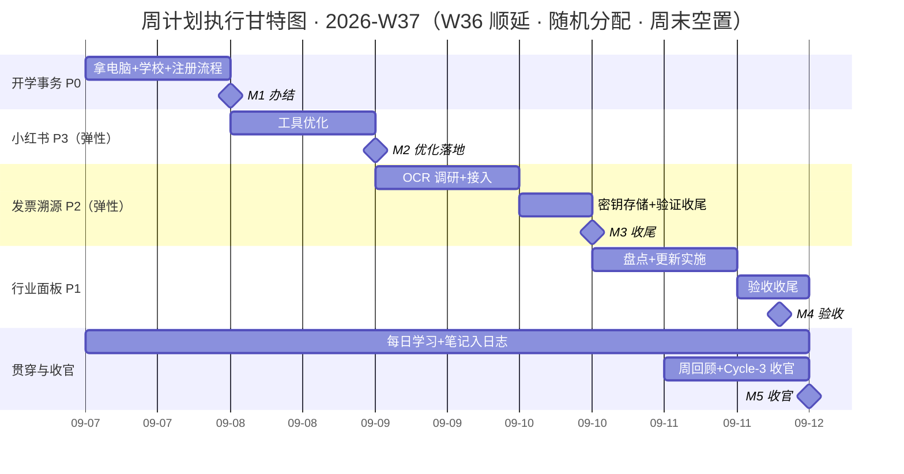

# 周计划执行表 · 2026-W37（AGENT.md 格式）

> 本文件按 AGENT.md 约定编写：任务有全局唯一 ID、状态使用固定枚举、关键数据在 frontmatter 与 JSON 摘要中可程序化解析。AI 代理或人类执行者遵循同一套约定更新本文件。

---

## 0. 读取约定（Conventions）

| 元素 | 约定 |
| :--- | :--- |
| 任务 ID | `T01`–`T07`，沿用 W36 编号（顺延任务不改 ID）；依赖、里程碑、风险均通过 ID 引用 |
| 状态枚举 | `todo` 待开始 / `in_progress` 进行中 / `done` 已完成 / `blocked` 阻塞 |
| 日期格式 | 机器可读字段一律 ISO `YYYY-MM-DD`（frontmatter、JSON）；表格保留「周一 09-07」便于人读 |
| 优先级 | P0（最高）→ P6，P 值越小越优先 |
| 弹性任务 | T03 / T04 / T05 为弹性任务（「有空就干，没空顺延」）：顺延不视为失败，改状态为 `todo` 并移入下周，不标 `blocked` |
| 周末约定 | 周六 09-12 / 周日 09-13 **不排任何任务**；顺延项一律落入下周一（09-14），不得塞进周末 |
| 数据权威性 | §2 任务登记表为唯一事实来源；§7 甘特图仅为可视化，改任务以登记表为准 |
| 更新规则 | 每完成一个交付节点：更新任务状态、§6 里程碑状态、frontmatter `status` 与 `priority_p0_complete`；风险只追加不删除；决策写入 §9 决策日志 |
| 未完成任务 | 若计划过期（today > period_end）且任务仍为 `todo`，先询问是否顺延/重排，不要静默修改日期 |

---

## 1. 周目标（Mission）

W36 顺延周。上周（W36，08-31~09-06）已过期且任务全部未启动，按用户指示整周顺延至本周：任务顺序由系统随机数打乱分配（结果恰好 T01 落周一、T02 收周五），周六/周日不排任何任务，周末彻底休息。个人主线保持：工作日每晚学习、记笔记、进日志。

**可衡量结果（Objective & Key Results）：**
- [x] **KR1**：T01 周一（09-07）开学事务全部办结——电脑取回、学校布置完成、注册流程走完 ✅
- [x] **KR2**：T02 行业面板内容更新完成并通过验收（周五 09-11）→ 实际 09-10 内容全部制作完成，提前一天 ✅
- [x] **KR3**：T03 发票溯源服务器 OCR + 密钥存储落地（周四 09-10，弹性，顺延不判失败）→ 实际 09-11 完成 ✅
- [x] **KR4**：T06 工作日（09-07~09-11）每日学习笔记进日志不断档；周末不排任务

---

## 2. 任务登记表（Task Registry）

| ID | 任务 | 优先级 | 状态 | 计划开始 | 计划结束 | 工时 | 交付物 | 依赖 |
| :-: | :--- | :----: | :---: | :---: | :---: | :--: | :--- | :--- |
| T01 | 开学事务：拿电脑 + 学校布置 + 注册流程（W36 顺延） | P0 | `done` | 周一 09-07 | 周一 09-07 | 1.0 天 | 电脑取回 + 学校布置完成 + 注册流程办结凭证 | – |
| T04 | 小红书开发工具继续优化（弹性） | P3 | `todo` | 周二 09-08 | 周二 09-08 | 1.0 天 | 优化记录 + 可验证的改进项 | – |
| T03 | 发票溯源续更：服务器 OCR + 密钥存储（弹性） | P2 | `done` | 周三 09-09 | 周四 09-10 | 1.5 天 | 可用 OCR 链路 + 密钥安全存储落地 | – |
| T02 | 行业面板内容更新（新任务 · 硅行业看板） | P1 | `done` | 周四 09-10 | 周五 09-11 | 1.5 天 | 更新后的行业面板 + 验收记录 | – |
| T05 | 单词卡立项：Anki 方案调研 + MVP 规划（弹性） | P4 | `todo` | 碎片穿插 | 碎片穿插 | 0.5 天 | 方案调研结论 + MVP 开发排期建议 | – |
| T06 | 每日学习 + 笔记入日志（贯穿工作日） | P5 | `todo` | 周一 09-07 | 周五 09-11 | 5.0 小时 | 每日日志（学习内容 + 笔记沉淀） | – |
| T07 | 周回顾 + Cycle-3 收官复盘（W36 顺延） | P6 | `done` | 周五 09-11 | 周五 09-11 | 2.0 小时 | W37 回顾 + 周期评分 + Cycle-4 规划输入 | T01–T06 |
| 加塞 | 影子微信机器人换模型 GLM-5.3-Flash | 加塞 | `done` | 随时穿插 | 随时穿插 | 不计 | 替换完成验证记录 | – |
| 加塞2 | 服务器运维 MCP 搭建（09-10 新增加塞） | 加塞 | `done` | 周四 09-10 | 周四 09-10 | 不计 | 服务器运维 MCP + 验证记录 | – |

> 本周为 W36 整周顺延：任务顺序由系统随机数打乱分配，原排期依赖链（T02 dep T01、T03 dep T02）随随机模式作废，若与现实冲突手动对调即可；周六/周日（09-12 / 09-13）不排任何任务。
> T05 改为碎片时间穿插（通勤/晚间，周末除外），不占白天槽位；加塞任务不占工时预算、不挤占原计划（承接 W35 顺延项）。
> 🔒 安全整改（Obsidian 密钥清理 + GitHub 整改，7 项目）按约定**暂不执行**，等 Bruce 确认时机；🚫 硅行业系统继续暂缓待老板过稿。

---

## 3. 任务详情与验收标准（含 DoD）

> 每个任务块使用固定子标题：`目标` / `关键动作` / `验收标准(DoD)` / `交付物`。验收标准即完成定义——全部满足才可将状态置为 `done`。

### T01 · 开学事务：拿电脑 + 学校布置 + 注册流程 `P0 · done`（09-07 办结）

**目标**：把 W36 顺延下来的三件开学事务集中办结，不带尾巴。

**关键动作**
- [x] 上午去公司取回电脑
- [x] 去学校布置相关事宜
- [x] 注册流程全部走完，留存办理凭证/截图

**验收标准(DoD)**
- [x] 电脑已取回并可用
- [x] 学校布置事项完成
- [x] 注册流程全部办结，无遗留步骤

**交付物**：事务办结记录（日志）

### T04 · 小红书开发工具继续优化（弹性） `P3 · todo`

**目标**：在 MVP 基础上继续优化小红书开发工具，推进可验证的改进项。

**关键动作**
- [ ] 列出当前待优化项，选 1-2 项实施
- [ ] 改进验证并记录

**验收标准(DoD)**
- [ ] 至少 1 项优化落地并验证可用
- [ ] 优化内容有记录，便于后续迭代

**交付物**：优化记录 + 可验证的改进项

> 弹性任务：顺延不视为失败，移入下周继续（参照 §0 弹性任务约定）。

### T03 · 发票溯源续更：服务器 OCR + 密钥存储（弹性） `P2 · done`（09-11 完成）

**目标**：解决发票溯源在服务器端的 OCR 识别与密钥存储问题，密钥按安全规范落地。

**关键动作**
- [x] OCR 方案调研与选型（周三上午）：服务对比、成本、精度
- [x] 服务器端 OCR 接入与联调（周三下午）
- [x] 密钥存储改造 + 端到端验证收尾（周四上午）：OCR 及相关密钥统一走安全存储（环境变量 / 密钥服务），源码与配置不留明文

**验收标准(DoD)**
- [x] 服务器端 OCR 链路可用，识别结果可验证
- [x] 所有新增密钥走安全存储，仓库与配置中无明文密钥
- [x] 端到端验证通过，无阻断性问题

**交付物**：可用 OCR 链路 + 密钥存储改造记录

> 弹性任务：顺延不视为失败，移入下周继续（参照 §0 弹性任务约定）。

### T02 · 行业面板内容更新（硅行业看板） `P1 · done`（09-10 内容全部制作完成，提前于计划）

**目标**：完成行业面板的内容更新，更新准确、可验收。

**关键动作**
- [x] 盘点待更新内容，输出更新清单（周四下午）
- [x] 实施内容更新（09-10 全部内容制作完成）
- [x] 自查 + 验收收尾（以 Bruce 09-10 口径「制作完所有内容」为准）

**验收标准(DoD)**
- [x] 更新清单经确认，无遗漏项
- [x] 面板内容更新完成，数据/文案准确
- [x] 自查通过，可交付验收

**交付物**：更新后的行业面板（硅行业看板）+ 更新清单与验收记录

### T05 · 单词卡立项：Anki 方案调研 + MVP 规划（弹性） `P4 · todo`

**目标**：把单词卡投入新一轮计划开发，先出方案结论再动手。

**关键动作**
- [ ] 碎片时间调研 Anki 开源生态（间隔重复 / 牌组 / 同步）的接入方式（通勤/晚间，周末除外）
- [ ] 明确词库来源与「每日学习 + 记笔记」节奏的绑定方式
- [ ] 输出方案结论 + MVP 排期建议，灵感沉淀见 [[创作区/开发灵感/单词卡开发灵感]]

**验收标准(DoD)**
- [ ] 方案结论明确（自建 or 复用 Anki、词库来源、与日志的衔接）
- [ ] MVP 范围与排期建议可指导后续开发

**交付物**：单词卡方案调研结论 + MVP 排期建议

### T06 · 每日学习 + 笔记入日志（贯穿工作日） `P5 · todo`

**目标**：开学第二周保持稳定节奏——工作日每天学习、记笔记，并沉淀进当天日志；周末休息，不排任务。

**关键动作**
- [ ] 工作日每天学习 + 记笔记
- [ ] 当天写入日志（干了什么 / 感受 / 卡点）
- [ ] 值得沉淀的知识丢 [[知识卡片/raw/README|raw 素材箱]]

**验收标准(DoD)**
- [ ] 工作日（09-07~09-11）日志无缺勤
- [ ] 周末不排学习任务（休息日想写补一行也算加分不断档）
- [ ] 学习内容有笔记、有沉淀去向

**交付物**：9/7-9/11 工作日每日日志

### T07 · 周回顾 + Cycle-3 收官复盘（W36 顺延） `P6 · done`（09-11 完成，据 9-11 日志勾选）

**目标**：W36 顺延后，Cycle-3 收官复盘一并补做（原定 09-06，已过期），周五晚完成周回顾与周期收官。

> ⚠️ 09-13 定时同步注记：状态置 `done` 以 Bruce 9-11 日志勾选为准；但 W37 周回顾板块与周期评分表（第 11/12 周）在库内仍为空，下方细项复选框未代勾——若复盘已在别处完成请自行补勾/补记，未做完请说明。

**关键动作**
- [ ] 填写 W37 周回顾与周期目标评分
- [ ] Cycle-3 整体复盘：达成情况、W36 整周未启动的原因、遗留项、经验教训
- [ ] 输出 Cycle-4 规划输入（含单词卡 MVP、安全整改时机、硅行业重启条件）

**验收标准(DoD)**
- [ ] W37 回顾 + 评分完成
- [ ] Cycle-3 收官结论清晰，遗留项全部有去向
- [ ] Cycle-4 规划输入成文

**交付物**：周期评分 + Cycle-4 规划输入

> 若周五晚来不及，可简化为清单式复盘或顺延至下周一（09-14）早补，**不占用周末**。

### 加塞 · 影子微信机器人换模型 GLM-5.3-Flash `加塞 · done`（09-10 完成）

**目标**：承接 W35 顺延项，模型替换为 GLM-5.3-Flash，随时穿插完成，不挤占原计划。

**关键动作**
- [x] 替换模型配置
- [x] 验证对话正常，记录变更

**验收标准(DoD)**
- [x] 机器人正常应答，模型确认为 GLM-5.3-Flash
- [x] 变更记录留档

**交付物**：替换验证记录

### 加塞2 · 服务器运维 MCP 搭建 `加塞 · done`（09-10 完成）

**目标**：搭建服务器运维 MCP（Bruce 09-10 新增加塞），便于代理直接运维服务器。

**关键动作**
- [x] MCP 搭建与配置
- [x] 验证可用，记录留档

**交付物**：服务器运维 MCP + 验证记录

---

## 4. 每日执行时间线（Schedule）

### 周一 09-07 · 开学事务日（W36 顺延）

| 时段 | 任务 ID | 任务 | 要点 |
| :--- | :-----: | :--- | :--- |
| 白天 | T01 | 拿电脑 + 学校布置 + 注册流程 | 三件事一次办结，留凭证 |
| 晚上 | T06 | 学习 + 笔记 → 日志 | 每日固定项 |

### 周二 09-08 · 小红书工具优化（弹性）

| 时段 | 任务 ID | 任务 | 要点 |
| :--- | :-----: | :--- | :--- |
| 09:00–12:00 | T04 | 列待优化项，选 1-2 项实施 | 有空就干，没空顺延 |
| 14:00–18:00 | T04 | 改进验证 + 记录 | 至少 1 项落地验证 |
| 晚上 | T06 | 学习 + 笔记 → 日志 | 每日固定项 |

### 周三 09-09 · 发票溯源攻坚 I

| 时段 | 任务 ID | 任务 | 要点 |
| :--- | :-----: | :--- | :--- |
| 09:00–12:00 | T03 | 发票溯源 · OCR 方案调研选型 | 服务对比、成本、精度，出选型结论 |
| 14:00–18:00 | T03 | 服务器 OCR 接入与联调 | 按选型结论接入，端到端跑通 |
| 碎片 | T05 | 单词卡 · Anki 生态调研（穿插） | 通勤/晚间碎片，不占白天 |
| 晚上 | T06 | 学习 + 笔记 → 日志 | 每日固定项 |

### 周四 09-10 · 发票溯源收尾 + 行业面板启动

| 时段 | 任务 ID | 任务 | 要点 |
| :--- | :-----: | :--- | :--- |
| 09:00–12:00 | T03 | 密钥存储改造 + 端到端验证收尾 | 密钥统一走安全存储，标记 T03 完成 |
| 14:00–18:00 | T02 | 行业面板 · 内容盘点 | 输出待更新清单，拿不准先问 |
| 晚上 | T06 | 学习 + 笔记 → 日志 | 每日固定项 |

### 周五 09-11 · 行业面板验收 + 周收官

| 时段 | 任务 ID | 任务 | 要点 |
| :--- | :-----: | :--- | :--- |
| 09:00–12:00 | T02 | 行业面板 · 更新实施 | 按清单更新，边改边自查 |
| 14:00–18:00 | T02 | 行业面板 · 自查 + 验收收尾 | 自查通过，标记 T02 完成 |
| 晚上 | T07 | 周回顾 + Cycle-3 收官复盘（顺延补做） | 评分 + Cycle-4 规划输入 |
| 晚上 | T06 | 学习 + 笔记 → 日志 | 复盘后补当日日志 |

### 周六 09-12 / 周日 09-13 · 周末（不排任务）

按用户要求周末完全空置：不排工作任务，也不排学习任务。周五晚未完成的顺延项一律落入下周一（09-14），不塞进周末。

---

## 5. 工时分配（Workload，单位：小时）

| 任务 | 周一 | 周二 | 周三 | 周四 | 周五 | 合计 |
| :--- | :--: | :--: | :--: | :--: | :--: | :--: |
| T01 开学事务 P0 | 7 | – | – | – | – | 7 |
| T04 小红书 P3（弹性） | – | 7 | – | – | – | 7 |
| T03 发票溯源 P2（弹性） | – | – | 7 | 3.5 | – | 10.5 |
| T02 行业面板 P1 | – | – | – | 3.5 | 7 | 10.5 |
| T05 单词卡 P4（弹性） | 碎片 | 碎片 | 碎片 | 碎片 | 碎片 | 3.5 |
| T06 每日学习 P5 | 1 | 1 | 1 | 1 | 1 | 5 |
| T07 收官复盘 P6 | – | – | – | – | 2 | 2 |
| **当日合计** | **8** | **8** | **8** | **8** | **10** | **42** |

> 弹性任务（T03 / T04 / T05）工时为上限预估，没空就顺延；T05 为碎片穿插，不计入当日合计；加塞任务不计工时。周六/周日不排任务。

---

## 6. 里程碑与交付清单（Milestones）

| 里程碑 ID | 日期 | 里程碑 | 关联任务 | 交付物 | 状态 |
| :---: | :--- | :--- | :--- | :--- | :---: |
| M1 | 周一 09-07 | 开学事务全部办结 | T01 | 办结记录 + 首日日志 | `done` |
| M2 | 周二 09-08 | 小红书优化项落地（弹性） | T04 | 优化记录 + 可验证改进项 | `todo` |
| M3 | 周四 09-10 | 发票溯源 OCR + 密钥存储完成（弹性） | T03 | OCR 链路 + 密钥规范落地 | `done`（09-11 完成） |
| M4 | 周五 09-11 | 行业面板更新验收完成 | T02 | 更新后的行业面板 + 验收记录 | `done`（09-10 提前完成） |
| M5 | 周五 09-11 | 周回顾 + Cycle-3 收官复盘完成 | T07 | 周期评分 + Cycle-4 规划输入 | `done`（09-11，据日志勾选；产出未落库待补） |

---

## 7. 任务进度甘特图（可视化）



---

## 8. 风险登记册（Risk Register）

| 风险 ID | 级别 | 风险 | 影响任务 | 应对预案 | 状态 |
| :---: | :--: | :--- | :--- | :--- | :---: |
| R1 | 🔴 高 | 5.5 天工作量压进 5 个工作日（35h 白天槽位全满）且周末空置，任一任务超时即无缓冲 | T01–T05 | T05 已转碎片穿插；弹性任务（T03/T04/T05）超时顺延 W38 不判失败；顺延项落下周一，不塞周末 | `open` |
| R2 | 🟡 中 | 行业面板周四下午才启动，若边界不清返工，周五验收窗口很紧 | T02 | 启动先出内容清单再动手；拿不准的先问清楚 | `closed`（T02 已 09-10 提前完成） |
| R3 | 🟡 中 | OCR 服务选型 / 成本 / 精度不确定 | T03 | 周三先出方案对比再接入；密钥一律走安全存储，源码与配置不留明文 | `closed`（T03 已 09-11 完成） |
| R4 | 🟢 低 | 工作日晚上学习日志断更 | T06 | 学习 + 笔记进日志设为每日固定项；周末休息不排任务，想写补一行也算不断档 | `open`（9/8–9/9 缺勤已发生，收官时说明） |
| R5 | 🟢 低 | 周五晚行业面板收尾与周复盘叠加（晚间 3h 负荷偏高） | T07 | 复盘可简化为清单式，或顺延下周一早补，不占用周末 | `closed`（T07 已 09-11 完成） |

---

## 9. 决策日志（Decision Log）

> 记录执行中做出的关键决策。格式：日期 · 决策 · 理由 · 影响任务。只追加，不删除。

| 日期 | 决策 | 理由 | 影响任务 |
| :--- | :--- | :--- | :--- |
| 2026-09-07 | W36 全部任务整周顺延至 W37，采用随机分配，周六/周日不排任何任务 | 用户明确指示（today=09-07，W36 已过期且任务全 `todo`，符合 §0「先询问是否顺延」的答复） | T01–T07 |
| 2026-09-07 | 随机分配用系统随机数打乱任务块顺序，结果：T01→周一、T04→周二、T03→周三~周四上午、T02→周四下午~周五 | 用户要求随机分配；随机结果恰好保住 T01→T02 先后（拿电脑在行业面板之前），原依赖链其余作废 | T01–T04 |
| 2026-09-07 | T05 单词卡调研改为碎片时间穿插，不占白天槽位 | 白天槽位恰被 T01–T04 填满（10/10 半天槽）；T05 本就是 P4 弹性任务 | T05 |
| 2026-09-07 | T07 复盘由周日移至周五晚，Cycle-3 收官复盘一并补做 | 周末不排任务；复盘应在最后一个工作日收口；W36 整周未启动需纳入复盘范围 | T07 |
| 2026-09-10 | Catch-up 补记：T01 确认 09-07 办结置 `done`；T02 行业面板（硅行业看板）内容全部制作完成置 `done`，较计划提前一天 | 用户口径「制作完硅行业看板所有内容」；09-08~09-09 任务完成未及时记录，今日统一补记同步 | T01 / T02 |
| 2026-09-10 | 加塞 SIDE-01 影子机器人搭建（换模型 GLM-5.3-Flash）完成置 `done`；新增加塞 SIDE-02 服务器运维 MCP 搭建，当日完成置 `done`；新增个人任务「健身打卡」 | 用户 09-10 安排并确认完成 | 加塞 / 加塞2 |
| 2026-09-13 | 定时同步（依据 9-11 日志勾选）：T03 发票溯源 OCR+密钥 09-11 完成置 `done`（KR3 补实际完成日，此前 KR3 勾选漂移疑点就此关闭）；T07 周回顾+Cycle-3 复盘 09-11 完成置 `done`，但 W37 周回顾板块/周期评分表未落库，细项复选框未代勾待 Bruce 补记；T05 单词卡 09-11 方案调研部分达成，MVP 规划与方案结论未落盘，保持 `todo` 随 Cycle-4 | Bruce 9-11 日志勾选为事实依据；库内无对应产出落盘的部分按「拿不准不动」原则不代勾、不代写 | T03 / T05 / T07 |

---

## 10. 机器可读摘要（Machine-readable JSON）

> 程序化解析用；与 §2 任务登记表保持一致。

```json
{
  "plan_id": "W37-2026",
  "type": "weekly-plan",
  "carry_over_from": "W36-2026",
  "assignment_mode": "random-shuffle",
  "weekend_policy": "free-no-tasks",
  "period": { "start": "2026-09-07", "end": "2026-09-13", "scheduled_days": "2026-09-07~2026-09-11" },
  "status": "in_progress",
  "owner": "Bruce",
  "theme": "W36 顺延周：开学事务 + 小红书优化 + 发票溯源（OCR+密钥）+ 行业面板更新（随机排布，周末空置）",
  "tasks": [
    { "id": "T01", "name": "开学事务：拿电脑+学校布置+注册流程", "priority": "P0", "status": "done", "start": "2026-09-07", "end": "2026-09-07", "hours": 7, "elastic": false, "depends_on": [] },
    { "id": "T04", "name": "小红书开发工具继续优化", "priority": "P3", "status": "todo", "start": "2026-09-08", "end": "2026-09-08", "hours": 7, "elastic": true, "depends_on": [] },
    { "id": "T03", "name": "发票溯源续更：服务器OCR+密钥存储", "priority": "P2", "status": "done", "start": "2026-09-09", "end": "2026-09-11", "hours": 10.5, "elastic": true, "depends_on": [], "note": "实际 09-11 完成（据 9-11 日志勾选），较计划弹性顺延一天内落地" },
    { "id": "T02", "name": "行业面板内容更新（硅行业看板）", "priority": "P1", "status": "done", "start": "2026-09-10", "end": "2026-09-11", "hours": 10.5, "elastic": false, "depends_on": [], "note": "实际 09-10 内容全部制作完成，提前于计划" },
    { "id": "T05", "name": "单词卡立项：Anki方案调研+MVP规划", "priority": "P4", "status": "todo", "start": null, "end": null, "hours": 3.5, "elastic": true, "depends_on": [], "note": "09-11 方案调研完成（9-12 周末随手翻延续）；MVP 规划与方案结论未落盘，随 Cycle-4 立项输出" },
    { "id": "T06", "name": "每日学习+笔记入日志（工作日贯穿）", "priority": "P5", "status": "todo", "start": "2026-09-07", "end": "2026-09-11", "hours": 5, "elastic": false, "depends_on": [] },
    { "id": "T07", "name": "周回顾+Cycle-3收官复盘（W36顺延补做）", "priority": "P6", "status": "done", "start": "2026-09-11", "end": "2026-09-11", "hours": 2, "elastic": false, "depends_on": ["T01", "T02", "T03", "T04", "T05", "T06"], "note": "09-11 完成据日志勾选；W37 周回顾板块/周期评分表未落库，待 Bruce 补记" }
  ],
  "sidetasks": [
    { "id": "SIDE-01", "name": "影子微信机器人换模型 GLM-5.3-Flash", "status": "done", "note": "加塞，不挤占原计划；承接 W35 顺延；09-10 搭建完成" },
    { "id": "SIDE-02", "name": "服务器运维 MCP 搭建", "status": "done", "note": "09-10 新增加塞，当日完成" }
  ],
  "onhold": [
    { "name": "安全整改（Obsidian密钥清理 + GitHub整改，7项目）", "reason": "按约定暂不执行，等 Bruce 确认时机" },
    { "name": "硅行业市场分析系统", "reason": "待老板过稿重启（需求文档在桌面）" }
  ],
  "milestones": [
    { "id": "M1", "date": "2026-09-07", "name": "开学事务全部办结", "task_ids": ["T01"], "status": "done" },
    { "id": "M2", "date": "2026-09-08", "name": "小红书优化项落地（弹性）", "task_ids": ["T04"], "status": "todo" },
    { "id": "M3", "date": "2026-09-11", "name": "发票溯源OCR+密钥存储完成（弹性）", "task_ids": ["T03"], "status": "done", "note": "实际 09-11 完成" },
    { "id": "M4", "date": "2026-09-11", "name": "行业面板更新验收完成", "task_ids": ["T02"], "status": "done", "note": "实际 09-10 提前完成" },
    { "id": "M5", "date": "2026-09-11", "name": "周回顾+Cycle-3收官复盘完成", "task_ids": ["T07"], "status": "done", "note": "09-11 据日志勾选；产出未落库待补" }
  ],
  "risks": [
    { "id": "R1", "level": "high", "task_ids": ["T01", "T02", "T03", "T04", "T05"], "status": "open" },
    { "id": "R2", "level": "medium", "task_ids": ["T02"], "status": "closed" },
    { "id": "R3", "level": "medium", "task_ids": ["T03"], "status": "closed" },
    { "id": "R4", "level": "low", "task_ids": ["T06"], "status": "open" },
    { "id": "R5", "level": "low", "task_ids": ["T07"], "status": "closed" }
  ]
}
```

---

*2026-W37 · 2026-09-07 至 2026-09-13（任务仅排周一~周五，周末空置）· 7 tasks + 1 加塞 · 随机分配 · 顺延自 W36 · v1 AGENT.md 格式 · 创建于 2026-09-07（周一开工后转 `in_progress`）*
